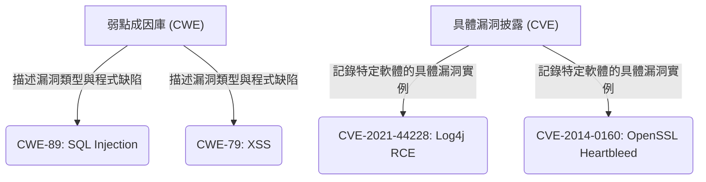
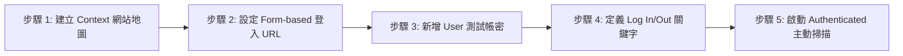

# 📖 課程教材：WEB安全與OWASP ZAP安全修補實踐指南

歡迎來到本課程！本指南是一份專為「網站弱點檢測與安全改善」設計的整合型教材。
本指南將帶領您從 Web 安全的基本理論出發，熟悉自動化掃描工具 **OWASP ZAP**，並配合 **VulnCampus PHP Lab** 靶場進行完整的安全修補與漏洞驗證實踐。

---

## 📅 第一章：Web 安全與漏洞標準概論

在進入實作之前，我們必須先建立資安領域的「共同語言」。當我們說一個網站有「漏洞」時，該如何對其進行分類、評級與描述？

### 1.1 什麼是 Web 應用程式安全？
Web 應用程式安全（Web Application Security）專注於保護網站、Web 服務與 API 免受惡意攻擊。由於 Web 服務通常必須公開給網際網路存取，且直接與後端資料庫及伺服器系統互動，因此成為黑客最主要的攻擊目標。

---

### 1.2 漏洞的身份證：CWE 與 CVE

在資安業界，我們使用兩套標準來標識漏洞：



#### 1. 什麼是 CWE (Common Weakness Enumeration)？
* **定義**：常見弱點列舉。由 MITRE 協會維護，是一個**「漏洞類型與程式缺陷」的字典**。
* **用途**：CWE 不針對特定軟體，而是描述漏洞的**本質成因**。例如，不論是 PHP、Java 還是 Python 寫的網站，只要沒做好輸入過濾就拼接 SQL，其弱點成因都歸類為 [CWE-89: SQL Injection](https://cwe.mitre.org/data/definitions/89.html)。
* **常見 CWE 範例**：
  * **CWE-79**：跨站腳本攻擊 (XSS)
  * **CWE-22**：路徑遍歷 (Path Traversal)
  * **CWE-287**：身分驗證不當 (Improper Authentication)

#### 2. 什麼是 CVE (Common Vulnerabilities and Exposures)？
* **定義**：常見漏洞與披露。同樣由 MITRE 維護，是**「已公開的特定軟體具體漏洞」官方清單**。
* **用途**：CVE 記錄的是**特定廠商、特定產品、特定版本**中真實被發現的漏洞實例。�## 🛠️ 第二章：OWASP ZAP 弱點掃描工具實務

在進行動態網站弱點分析時，**OWASP ZAP (Zed Attack Proxy)** 是全球業界使用最廣泛的開源動態應用程式安全測試 (DAST) 工具。

### 2.1 ZAP 的發展歷史與背景
* **起源與演進**：
  ZAP 專案由資安專家 Simon Bennetts 於 2010 年創立。最初它是基於已停止維護的 Java 代理工具 **Paros Proxy** 的原始碼進行重構開發。
* **專案定位**：
  ZAP 長期以來是 OWASP (開放網路軟體安全計劃) 旗下的旗艦級 (Flagship) 開源專案。目前由 **Software Security Project (SSP)** 與 Linux 基金會共同託管。
* **核心優勢**：
  作為一款開源、免費、跨平台的安全檢測軟體，ZAP 提供豐富的擴充套件，並內置完整的 API 介面與命令行整合，使得它不僅適合手動滲透測試，更是自動化 DevSecOps 整合的首選。

---

### 2.2 ZAP 的工作定位與中間人代理原理
ZAP 屬於 **DAST (Dynamic Application Security Testing)** 工具。它在**程式運行時**從外部發起攻擊探測，這與 **SAST (Static Code Analysis)** 靜態原始碼掃描（直接看代碼）不同。

ZAP 的核心是一個「中間人」代理伺服器 (Intercepting Proxy)：

```text
[ 瀏覽器 ] <======== (HTTP 請求 / 回應) ========> [ OWASP ZAP (Proxy) ] <======== (HTTP 請求 / 回應) ========> [ 目標網站伺服器 ]
                                                   * 記錄流量
                                                   * 修改參數
                                                   * 發送 Payload
```

當瀏覽器設定 ZAP 為 Proxy 後，所有發往目標網站的流量都必須經過 ZAP。ZAP 可以：
1. **記錄流量**：分析網頁結構，發掘潛在端點。
2. **攔截與修改 (Breakpoints)**：暫停請求，手動修改隱藏欄位或參數再送出。
3. **主動重放與重播 (Fuzzing / Repeater)**：用不同的字典檔對特定輸入框進行暴力破譯。

---

### 2.3 安全防衛：ZAP 的四種工作模式 (Modes)
為防範檢測人員誤對非授權的外部生產系統發起主動攻擊，ZAP 提供了安全鎖（Mode 模式選擇）：
1. 🛡️ **Safe Mode (安全模式)**：在此模式下，任何具有潛在危害的主動行為（如主動掃描、Fuzzing、攔截改包）皆會被軟體強制禁用，僅能作為流量觀察。
2. 🔒 **Protected Mode (受保護模式)**：**最推薦日常檢測使用的模式**。僅允許對已被顯式列入「Context (上下文定義範圍)」的目標發送主動攻擊，對其他非 Scope 內的 URL 請求則禁止發起主動探測，可防止誤觸第三方系統。
3. 🌐 **Standard Mode (標準模式)**：無任何特殊限制，允許對任何訪問過的 URL 執行所有探測。
4. ⚔️ **ATTACK Mode (攻擊模式)**：當發現任何新頁面流經代理時，ZAP 會立即自動對該 URL 發起主動掃描，效率極高但攻擊性強，不適用於生產環境。

---

### 2.4 ZAP 的六大核心模組與強大功能

1. **攔截代理與中斷點 (Intercepting Proxy & Breakpoints)**：
   * 當瀏覽器發送 Request 時，可透過 ZAP 頂端工具列的「雙圓環中斷點」進行攔截，此時請求會被暫停在傳輸途中。測試人員可在 ZAP 中手動編輯 JSON Payload、更新 Session Cookie 或修改 Hidden Form 參數，再點選「放行」送至後端，這是手動驗證 IDOR 或邏輯漏洞的最核心手法。
2. **被動掃描 (Passive Scan)**：
   * **特徵**：不發送任何攻擊 Payload，只做「靜默觀察」。
   * **用途**：檢查回應標頭中是否缺失 `X-Frame-Options` 等安全 Response Headers，或是 Cookie 是否漏設 `HttpOnly`。
3. **傳統網頁爬蟲與 AJAX 爬蟲 (Spider & AJAX Spider)**：
   * **傳統 Spider**：解析 HTML 原始碼中的 `<a>` 標籤並向下爬行，建立網站地圖。
   * **AJAX Spider**：啟動一個真實的瀏覽器（如 Headless Chrome），模擬使用者的滑鼠點擊與 JS 互動，適合爬取現代單頁應用 (SPA) 與動態載入的網頁。
4. **主動掃描器 (Active Scan)**：
   * 利用多種預設的攻擊規則（SQLi、XSS、Path Traversal、RCE 等），大量且高速地對網站的 URL、POST Body、甚至 HTTP Headers 發送攻擊載荷，並比對返回的特徵來判定漏洞。
5. **模糊測試模組 (Fuzzing)**：
   * 允許測試人員選取 Request 中的特定參數（如登入密碼欄位），載入自訂字典檔（Wordlist）發送大量併發請求，可用於密碼爆破、目錄爆破或 API Fuzzing。
6. **自訂規則腳本與市集 (Scripts & Add-ons)**：
   * ZAP 支持多種腳本擴充，如 `Passive Rules` 允許以 JS 撰寫被動規則，在網頁流量流經時進行自訂檢測。ZAP Marketplace 提供豐富的社群插件下載。

---

### 2.5 實戰指引：身分驗證掃描 (Authenticated Scan) 配置步驟

許多敏感頁面（如 `profile.php`）必須登入後才能存取。如果直接對首頁點選主動掃描，ZAP 會因為未登入而無法探測這些深層頁面。以下是設定 ZAP 自動登入掃描的完整步驟：



#### 步驟 1：建立 Context
1. 在 ZAP 左側「Site (網站地圖)」中，對您的靶場網址（例如 `http://localhost:8080`）點選右鍵 $\rightarrow$ **Include in Context** $\rightarrow$ **Default Context**。

#### 步驟 2：設定登入機制 (Authentication)
1. 雙擊左側的 **Default Context** 開啟設定面板，切換至 **Authentication** 頁面。
2. 在下拉選單中選擇 **Form-based Authentication**。
3. **Login Page URL** 輸入登入頁面網址：`http://localhost:8080/login.php`。
4. **POST Data** 會自動抓取登入表單參數，請將其修改為：`username=&password=`（ZAP 會自動以使用者清單中的帳密替換花括號內的變數）。

#### 步驟 3：定義登入成功與失敗指標 (Logged In / Logged Out Indicators)
ZAP 需要知道當前是否處於登入狀態：
* **Logged In Indicator (登入成功標識)**：輸入 `logout.php` 或您的帳號名稱（因為登入後畫面上會出現「登出」連結或歡迎詞）。
* **Logged Out Indicator (登入失敗/登出標識)**：輸入 `login.php`（因為未登入時會停留在登入頁面）。

#### 步驟 4：新增使用者 (Users)
1. 切換至 Context 設定面板下的 **Users** 頁面。
2. 點選 **Add**，輸入名稱 `student01`，使用者名稱填入 `student01`，密碼填入 `password123`。
3. 將該 User 設為 **Enabled**。

#### 步驟 5：執行身分驗證掃描
1. 在執行 Spider 或 Active Scan 時，在啟動對話框的 **User** 選項中，選擇剛才建立的 `student01`。
2. ZAP 即會在掃描過程中自動在 HTTP Header 中帶上登入後的 Cookie，完成對需要權限之頁面的深度安全掃描。

---

### 2.6 ZAP 掃描報告生成與 DevSecOps 整合利用

1. **產出報告步驟**：
   * 掃描完成後，點選上方選單 **Report** $\rightarrow$ **Generate Report**。
   * 選擇輸出路徑與格式（推薦選擇 **HTML** 格式供人工審查，**JSON/XML** 格式供程式化解析）。
2. **閱讀與解讀關鍵欄位**：
   * **Alerts (警報清單)**：依風險等級排序。點開後可看見對應的漏洞名稱。
   * **Attack**：ZAP 當時發送的惡意 Payload 內容。
   * **Evidence (證據)**：網頁回顯中被 ZAP 捕捉到的特徵（例如資料庫語法報錯資訊，用以證明漏洞確實存在）。
3. **報告的利用與 DevSecOps 實踐**：
   * **誤報研判與過濾 (False Positive Triaging)**：
     自動化掃描必然會產生誤報。檢測人員必須根據報告中的 **Attack** 與 **Evidence**，在 ZAP 中使用 **Repeater (重放器)** 手動發送請求，驗證漏洞是否確實存在。
   * **誤報標記 (Mark False Positive)**：
     在 ZAP 介面上，對確認是誤報的項目點擊右鍵標記為 `False Positive`，此警報將不會被計入最終產出的稽核報告中。
   * **CI/CD 自動化整合 (DAST Safety Gates)**：
     利用 **ZAP Automation Framework (AF)** 或 `zap2docker` 容器，可配合 `zap.yaml` 設定檔將掃描自動化整合進 CI/CD 流程。在系統部署至測試環境後，自動執行掃描，若發現 Critical/High 漏洞則自動中斷 pipeline 進行阻斷，落實軟體生命週期安全左移。**：檢查回應標頭中是否缺失 `X-Frame-Options` 等安全 Response Headers，或是 Cookie 是否漏設 `HttpOnly`。
2. **蜘蛛爬蟲 (Spider & AJAX Spider)**：
   * **傳統 Spider**：解析 HTML 原始碼中的 `<a>` 標籤並向下爬行，建立網站地圖。
   * **AJAX Spider**：啟動一個真實的瀏覽器（如 Headless Chrome），模擬使用者的滑鼠點擊與 JS 互動，適合爬取現代單頁應用 (SPA) 與動態載入的網頁。
3. **主動掃描 (Active Scan)**：
   * **特徵**：會向目標伺服器發送大量包含攻擊特徵（如 `UNION SELECT`、`<script>`）的請求。
   * **注意**：主動掃描具備攻擊性，**絕對只能對獲得授權的測試靶場執行**！
4. **模糊測試 (Fuzzing) 與中斷點 (Breakpoints)**：
   * 在工具欄點選 **綠色圓點** 即可開啟全域攔截。當瀏覽器送出表單時，ZAP 會攔截該 HTTP Request。您可以在 ZAP 介面修改其 POST 參數（如將 `role=student` 改為 `admin`），再點選 **放行 (Play)** 傳送給後端。

---

### 2.4 實戰指引：身分驗證掃描 (Authenticated Scan) 配置步驟

許多敏感頁面（如 `profile.php`）必須登入後才能存取。如果直接對首頁點選主動掃描，ZAP 會因為未登入而無法探測這些深層頁面。以下是設定 ZAP 自動登入掃描的完整步驟：


#### 步驟 1：建立 Context
1. 在 ZAP 左側「Site (網站地圖)」中，對您的靶場網址（例如 `http://localhost:8080`）點選右鍵 $\rightarrow$ **Include in Context** $\rightarrow$ **Default Context**。

#### 步驟 2：設定登入機制 (Authentication)
1. 雙擊左側的 **Default Context** 開啟設定面板，切換至 **Authentication** 頁面。
2. 在下拉選單中選擇 **Form-based Authentication**。
3. **Login Page URL** 輸入登入頁面網址：`http://localhost:8080/login.php`。
4. **POST Data** 會自動抓取登入表單參數，請將其修改為：`username=&password=`（ZAP 會自動以使用者清單中的帳密替換花括號內的變數）。

#### 步驟 3：定義登入成功與失敗指標 (Logged In / Logged Out Indicators)
ZAP 需要知道當前是否處於登入狀態：
* **Logged In Indicator (登入成功標識)**：輸入 `logout.php` 或您的帳號名稱（因為登入後畫面上會出現「登出」連結或歡迎詞）。
* **Logged Out Indicator (登入失敗/登出標識)**：輸入 `login.php`（因為未登入時會停留在登入頁面）。

#### 步驟 4：新增使用者 (Users)
1. 切換至 Context 設定面板下的 **Users** 頁面。
2. 點選 **Add**，輸入名稱 `student01`，使用者名稱填入 `student01`，密碼填入 `password123`。
3. 將該 User 設為 **Enabled**。

#### 步驟 5：執行身分驗證掃描
1. 在執行 Spider 或 Active Scan 時，在啟動對話框的 **User** 選項中，選擇剛才建立的 `student01`。
2. ZAP 即會在掃描過程中自動在 HTTP Header 中帶上登入後的 Cookie，完成對需要權限之頁面的深度安全掃描。

---

### 2.5 ZAP 掃描報告生成與閱讀指南

1. **產出報告**：
   * 掃描完成後，點選上方選單 **Report** $\rightarrow$ **Generate Report**。
   * 選擇輸出路徑與格式（推薦選擇 **HTML** 格式，方便直觀瀏覽）。
2. **閱讀關鍵欄位**：
   * **Alerts (警報清單)**：依風險等級排序。點開後可看見對應的漏洞名稱。
   * **URL**：受影響的網頁路徑。
   * **Parameter**：被注入的參數。
   * **Attack**：ZAP 當時發送的惡意 Payload 內容。
   * **Evidence (證據)**：網頁回顯中被 ZAP 捕捉到的特徵（例如資料庫語法報錯資訊，用以證明漏洞確實存在）。
   * **Solution (修復建議)**：ZAP 提供的標準防禦建議，開發者可參考其方向進行代碼修改。

---

## 🚀 第三章：VulnCampus PHP Lab 啟動與實踐指引

本章將引導您如何在本地部署並啟動 VulnCampus PHP Lab 靶場環境。

### 3.1 靶場快速啟動與還原指引
請確保您的本地電腦上已安裝好 **Docker** 與 **Docker Compose**。在專案根目錄下，開啟終端機（Terminal）並執行以下指令：

* **1. 啟動所有容器服務 (自動建置映像並背景運行)**：
  ```bash
  docker compose up -d --build
  ```
  
* **2. 停止服務並保留資料**：
  ```bash
  docker compose down
  ```
  
* **3. 徹底還原環境 (清空所有資料庫個資並重建)**：
  當靶場資料庫被學生測試用 SQL Injection 毀壞，或 uploads 目錄被 Webshell 塞滿時，請執行以下指令一鍵還原乾淨環境：
  ```bash
  docker compose down -v
  docker compose up -d --build
  ```

---

### 3.2 靶場網址與連接埠分配
啟動完成後，您可使用瀏覽器存取以下三個本地端點：
* 🔴 **弱點版網站 (app-vulnerable)**：`http://localhost:8080` (用於展示漏洞、攻擊演練與 ZAP 掃描)
* 🟢 **安全修正版網站 (app-fixed)**：`http://localhost:8081` (用於對照安全防禦、程式碼修補與防護驗證)
* 🛠️ **phpMyAdmin 資料庫管理員**：`http://localhost:8082` (登入帳密為 `root` / `rootpassword`，用以直接視覺化觀察漏洞注入寫入資料庫的狀況)

---

### 3.3 測試帳號與密碼對照表
靶場系統已預置了以下三種權限角色的測試帳密，供手動測試與 ZAP 登入配置使用：

| 角色 / 權限 | 帳號 (Username) | 弱點版密碼 | 修正版密碼 | 說明與用途 |
| :--- | :--- | :--- | :--- | :--- |
| **管理員** | `admin` | `admin` | `AdminPassword!2026` | 後台管理權限，用於測試垂直越權、名冊匯出與日誌審查。 |
| **一般學生 01** | `student01` | `password123` | `Student01Pass!2026` | 用於正常瀏覽、留言、活動報名與 IDOR 水平越權檢測。 |
| **一般學生 02** | `student02` | `password123` | `Student02Pass!2026` | 用於作為 IDOR 的被越權受害者（例如被 student01 修改資料）。 |
| **教師** | `teacher01` | `password123` | `Teacher01Pass!2026` | 具備檢視課程與部分後台唯讀權限。 |

---

## 🔬 第四章：VulnCampus 弱點實驗（LABs）分類與深度指引

本章將對應 `02_OWASP_TOP10_對照表.md` 中的 44 個漏洞點，依據 OWASP 風險大類重組為 **10 個極具深度的核心實驗單元**，詳述其實作方式、ZAP 掃出來的步驟、攻擊原理與修補細節。

---

### 🧪 LAB 1：權限控制與水平/垂直越權 (Broken Access Control)
* **相關檔案**：
  * 弱點版：[profile.php](file:///c:/Work/VulnCampus%20PHP%20Lab/app-vulnerable/public/profile.php) | [api/checkin_history.php](file:///c:/Work/VulnCampus%20PHP%20Lab/app-vulnerable/public/api/checkin_history.php) | [admin/export_registrations.php](file:///c:/Work/VulnCampus%20PHP%20Lab/app-vulnerable/public/admin/export_registrations.php) | [helpers.php](file:///c:/Work/VulnCampus%20PHP%20Lab/app-vulnerable/src/helpers.php)
  * 修正版：[profile.php](file:///c:/Work/VulnCampus%20PHP%20Lab/app-fixed/public/profile.php) | [api/checkin_history.php](file:///c:/Work/VulnCampus%20PHP%20Lab/app-fixed/public/api/checkin_history.php) | [admin/export_registrations.php](file:///c:/Work/VulnCampus%20PHP%20Lab/app-fixed/public/admin/export_registrations.php) | [helpers.php](file:///c:/Work/VulnCampus%20PHP%20Lab/app-fixed/src/helpers.php)
* **資安概念**：CWE-639 (物件層級越權 IDOR)、CWE-285 (垂直授權不當)、CWE-484 (Switch 語句直通 Fall-through)、CWE-915 (Mass Assignment)。

#### 🔍 ZAP 掃描與檢測方法
1. **Access Control Testing (存取控制測試)**：
   * ZAP 提供了強大的 **Access Control Testing** 插件。
   * **配置步驟**：
     1. 將 `http://localhost:8080` 加入 Context。
     2. 在 ZAP 的 **Users** 設定中，分別新增兩個角色：`student01`（學生）與 `admin`（管理員）並設定其對應之 Form-based 登入 Cookie。
     3. 切換到 ZAP 的 **Access Control** 面板，定義各 URL 預期的授權角色（例如限制 `/admin/export_registrations.php` 僅限 `admin` 角色存取）。
     4. 點選 **Start Scan**，ZAP 會分別以 `student01` 與 `admin` 的 Session 發送請求。
   * **掃描結果與證據**：ZAP 會發出 🔴 **Access Control Violation** 警報。在 Alert 中，會明確展示 `student01` 成功收到了 `200 OK` 且帶有名冊 CSV 的 Response，證明發生垂直越權。
2. **Active Scan 參數篡改偵測 (IDOR)**：
   * 當 ZAP 主動掃描 `profile.php?id=2` 時，會嘗試將 `id` 的數值更換為其他鄰近數值（如 `3`、`4`）。若 ZAP 比對回傳頁面結構與內容，發現成功獲取了非本人（學生02）的名義，即會對此參數發出 🟡 **Horizontal Privilege Escalation (IDOR)** 警報。

#### 🚀 手動驗證步驟與 Payload
1. **水平越權**：登入 `student01`，存取 `profile.php?id=2`。將網址列參數手動修改為 `id=3` (student02) $\rightarrow$ 成功讀取 student02 的資料並能進行竄改。
2. **API 水平越權**：直接訪問 `/api/checkin_history.php?user_id=3` $\rightarrow$ 讀出 student02 的歷史定位打卡足跡。
3. **Mass Assignment 升權**：編輯個人資料，按 F12 將隱藏表單 `<input type="hidden" name="role" value="student">` 的 `value` 修改為 `admin` 送出更新，重新登入後即獲得管理員權限。
4. **垂直越權**：以學生登入，直接在瀏覽器輸入後台名冊匯出端點 `http://localhost:8080/admin/export_registrations.php`，成功下載 CSV。
5. **Switch case 漏 break 越權 Bug**：以學生帳密直接造訪後台稽核日誌頁面 `http://localhost:8080/admin/logs.php`，發現竟然成功繞過防護進入。

#### 💥 攻擊原理分析
1. **權限校驗缺失**：後端直接採用用戶傳入的 `id` 進行 SQL 查詢，未與當前 Session 中的 `user_id` 比對。
2. **Switch 缺少 break (CWE-484)**：
   * 弱點版代碼中，在 `case 'student'` 後漏寫了 `break;`，導致程式流程直通到底，覆蓋並取得了管理員角色權限：
   ```php
   // 弱點版 helpers.php
   switch ($role) {
       case 'student':
           $permissions[] = 'view_courses'; // 漏寫 break!
       case 'teacher':
           $permissions[] = 'view_registrations'; // 漏寫 break!
       case 'admin':
           $permissions[] = 'admin_access';
           break;
   }
   ```

#### 🛡️ 防禦機制與安全修補代碼對照
* **IDOR 防禦**：強制在後端執行存取者身分與標的物擁有者身分的比對：
  ```php
  // 修正版 profile.php：
  $id = isset($_GET['id']) ? intval($_GET['id']) : $_SESSION['user']['id'];
  if ($id !== $_SESSION['user']['id'] && $_SESSION['user']['role'] !== 'admin') {
      http_response_code(403);
      die("權限不足：您無權修改他人個資！");
  }
  ```
* **Switch Bug 修補**：補齊 `break;` 防止權限向下流逸：
  ```php
  // 修正版 helpers.php：
  switch ($role) {
      case 'student':
          $permissions[] = 'view_courses';
          break; // 安全修補
      case 'teacher':
          $permissions[] = 'view_registrations';
          break; // 安全修補
      case 'admin':
          $permissions[] = 'admin_access';
          break;
  }
  ```

---

### 🧪 LAB 2：大頭貼上傳漏洞三部曲與 DoS 防護 (File Upload)
* **相關檔案**：
  * 弱點版：[upload_bypass_backend.php](file:///c:/Work/VulnCampus%20PHP%20Lab/app-vulnerable/public/upload_bypass_backend.php) | [upload.php](file:///c:/Work/VulnCampus%20PHP%20Lab/app-vulnerable/public/upload.php)
  * 修正版：[upload.php](file:///c:/Work/VulnCampus%20PHP%20Lab/app-fixed/public/upload.php)
* **資安概念**：CWE-434 (任意檔案上傳 Webshell)、CWE-400 (資源消耗/Upload DoS)。

#### 🔍 ZAP 掃描與檢測方法
1. **Active Scan (主動掃描上傳端點)**：
   * ZAP 內建 **External File Upload / Webshell Injection** 被動與主動檢測規則。
   * **配置與掃出步驟**：
     1. 使用 ZAP 手動瀏覽器造訪 `/upload_bypass_backend.php` 並上傳一個合法的圖片檔案，使此請求記錄於 ZAP **History**。
     2. 在該 POST 請求上點選右鍵 $\rightarrow$ **Attack > Active Scan**。
   * **ZAP 偵測與判定原理**：
     ZAP 的主動掃描會截獲該請求的 multipart/form-data 結構。它會將原本的 `filename="image.png"` 篡改為 `filename="zap-test-webshell.php"`，並將 `Content-Type` 修改為 `application/x-php` 或 `image/png` 以檢測過濾機制，並在 Body 寫入測試 PHP 代碼（如 `<?php print(12345*6789); ?>`）。
     接著，ZAP 會去嘗試訪問剛才回傳路徑中新生成的 `uploads/zap-test-webshell.php`。若存取時狀態碼為 `200 OK` 且 Response Body 中成功印出了計算結果 `83810205`，ZAP 即會發出 🔴 **Remote Code Execution - File Upload** 的最嚴重警報！

#### 🚀 手動驗證步驟與 Payload
1. **繞過 HTML 限制**：F12 刪除 input 上的 `accept` 屬性即可選取並上傳 `shell.php`。
2. **繞過前端 JS 限制**：選取圖片 `avatar.jpg`。開啟 ZAP Breakpoint。點選上傳，當 ZAP 攔截到 POST 請求時，將 multipart 表單段落中的 `filename="avatar.jpg"` 修改為 `filename="shell.php"`，接著放行釋放。
3. **繞過後端 Content-Type 檢測**：選取 `shell.php`，開啟 ZAP Breakpoint。在攔截到 POST 請求時，將 `Content-Type: application/x-php` 修改為 `Content-Type: image/png` 後放行，即可成功上傳 Webshell。

#### 💥 攻擊原理分析
1. **標頭信任漏洞**：後端程式若僅透過 `$_FILES['avatar']['type']` 驗證，實際上是在檢查 HTTP 請求標頭中的 Content-Type 欄位，此欄位完全可由黑客任意填寫偽造。此外，弱點版未檢查檔案大小，容易被上傳極大垃圾檔案造成 DoS。

#### 🛡️ 防禦機制與安全修補代碼對照
* **弱點版** (`app-vulnerable/public/upload.php`)：
  ```php
  // 直接信任客戶端提供的 type
  $allowed_types = ['image/jpeg', 'image/png', 'image/gif'];
  if (!in_array($_FILES['avatar']['type'], $allowed_types)) {
      die("格式不符！");
  }
  move_uploaded_file($_FILES['avatar']['tmp_name'], 'uploads/' . $_FILES['avatar']['name']);
  ```
* **修正版** (`app-fixed/public/upload.php`)：
  ```php
  // 雙重驗證：副檔名 + 真實二進位 Magic Bytes 檢驗，並加上檔案大小限制
  if ($_FILES['avatar']['size'] > 2 * 1024 * 1024) {
      die("檔案超過 2MB 限制");
  }
  $file_ext = strtolower(pathinfo($_FILES['avatar']['name'], PATHINFO_EXTENSION));
  $allowed_extensions = ['jpg', 'jpeg', 'png', 'gif'];

  $finfo = new finfo(FILEINFO_MIME_TYPE);
  $real_mime = $finfo->file($_FILES['avatar']['tmp_name']);
  $allowed_mimes = ['image/jpeg', 'image/png', 'image/gif'];

  if (in_array($file_ext, $allowed_extensions) && in_array($real_mime, $allowed_mimes)) {
      $new_name = bin2hex(random_bytes(16)) . '.' . $file_ext; // 強制改隨機名稱防止路徑穿越檔名注入
      move_uploaded_file($_FILES['avatar']['tmp_name'], 'uploads/' . $new_name);
  }
  ```

---

### 🧪 LAB 3：SQL 注入攻擊 (SQL Injection) 變體與預存程序安全
* **相關檔案**：
  * 弱點版：[courses.php](file:///c:/Work/VulnCampus%20PHP%20Lab/app-vulnerable/public/courses.php) | [sqli_variants.php](file:///c:/Work/VulnCampus%20PHP%20Lab/app-vulnerable/public/sqli_variants.php)
  * 修正版：[courses.php](file:///c:/Work/VulnCampus%20PHP%20Lab/app-fixed/public/courses.php) | [sqli_variants.php](file:///c:/Work/VulnCampus%20PHP%20Lab/app-fixed/public/sqli_variants.php)
* **資安概念**：CWE-89 (SQLi)。

#### 🔍 ZAP 掃描與檢測方法
1. **Active Scan (SQL Injection Rule)**：
   * ZAP 內建了多種 SQL 注入檢測規則（包括 SQL Injection - Error Based、SQL Injection - Blind 等）。
   * **配置與掃出步驟**：
     1. 在 Sites 樹中尋找 `/courses.php`，點擊右鍵 $\rightarrow$ **Attack > Active Scan**。
     2. 在主動掃描設定中，確保已啟用 SQL Injection 檢測引擎並執行。
   * **ZAP 偵測與判定原理**：
     * **UNION / Error Based SQLi**：ZAP 會發送含有單引號與 SQL 注入的 Payload（如 `q=1' AND '1'='1`、`q=' OR 1=1 -- `）。若 Response 中包含 MariaDB/MySQL 的語法報錯訊息（如 `You have an error in your SQL syntax`），ZAP 會截取此報錯字串作為證據 (Evidence)，並發出 🔴 **SQL Injection** 警報。
     * **Time-Based SQLi**：在被檢測參數中，ZAP 會發送帶有延遲函數的 Payload（如 `id=1 AND SLEEP(5)`）。ZAP 會精確計算發出請求到收到響應的時間差。若此請求的延遲時間顯著大於基準網頁回應時間，且符合注入延遲，ZAP 即會判定存有盲注並發出警報。

#### 🚀 手動驗證步驟與 Payload
1. **UNION 注入**：在 `courses.php` 搜尋框輸入：
   `' UNION SELECT 1, username, password_hash, role, 5, 6, 7 FROM users -- ` $\rightarrow$ 列出帳密 Hash。
2. **預存程序注入**：在 `/sqli_variants.php?tab=sp` 中輸入 `1) OR 1=1 -- ` $\rightarrow$ 閉合括號成功繞過原課程 ID 限制。

#### 💥 攻擊原理分析
1. **代碼與資料混淆**：當後端把變數直接拼入 SQL 字串時，單引號 `'` 被視為 SQL 語法結構的一部分。在預存程序中，若使用 `$pdo->query("CALL get_course('$input')")` 字串拼接，其參數在被資料庫解析時依然會被繞過注入。

#### 🛡️ 防禦機制與安全修補代碼對照
* **弱點版** (`app-vulnerable/public/courses.php`)：
  ```php
  // 直接字串拼接
  $sql = "SELECT * FROM courses WHERE title LIKE '%" . $q . "%'";
  $courses = $pdo->query($sql)->fetchAll();
  ```
* **修正版** (`app-fixed/public/courses.php`)：
  ```php
  // 使用 PDO Prepared Statements 參數化預編譯綁定
  $stmt = $pdo->prepare("SELECT * FROM courses WHERE title LIKE :q");
  $stmt->execute(['q' => "%" . $q . "%"]);
  $courses = $stmt->fetchAll();
  ```

---

### 🧪 LAB 4：跨站腳本攻擊 (XSS) 實戰全解析 (反射/儲存/DOM/PDF)
* **相關檔案**：
  * 弱點版：[xss_reflected.php](file:///c:/Work/VulnCampus%20PHP%20Lab/app-vulnerable/public/xss_reflected.php) | [xss_stored.php](file:///c:/Work/VulnCampus%20PHP%20Lab/app-vulnerable/public/xss_stored.php) | [pdf_xss_demo.php](file:///c:/Work/VulnCampus%20PHP%20Lab/app-vulnerable/public/pdf_xss_demo.php)
  * 修正版：[xss_reflected.php](file:///c:/Work/VulnCampus%20PHP%20Lab/app-fixed/public/xss_reflected.php) | [pdf_xss_demo.php](file:///c:/Work/VulnCampus%20PHP%20Lab/app-fixed/public/pdf_xss_demo.php)
* **資安概念**：CWE-79 (XSS)。

#### 🔍 ZAP 掃描與檢測方法
1. **Active Scan (Cross Site Scripting - Reflected/Stored)**：
   * **反射型偵測與掃出步驟**：
     ZAP 對 `xss_reflected.php?keyword=X` 進行 Active Scan 時，會發送帶有 HTML 標籤與特殊字元的 Payload（如 `keyword=<script>alert(1)</script>` 或 `keyword=<svg/onload=alert(1)>`）。
     ZAP 比對 Response Body，若網頁回傳原始碼中**完整且未經編碼地**包含了該惡意標籤，ZAP 判定可以直接執行，截取此段標籤為證據，發出 🔴 **Cross Site Scripting (Reflected)** 警報。
2. **DOM-based XSS (AJAX Spider + Active Scan)**：
   * **掃出步驟**：
     1. 對 `http://localhost:8080` 點選右鍵 $\rightarrow$ **Attack > AJAX Spider**（選取 Chrome 瀏覽器核心）執行。
     2. ZAP 會在動態解析中發現在 `xss_dom.php` 存有對 `location.hash` 的調用，並向 URL Hash 注入 ``。當 Chrome 背景渲染觸發了 JavaScript onerror 執行時，ZAP 會捕捉此事件發出 🔴 **Cross Site Scripting (DOM-Based)** 警報。

#### 🚀 手動驗證步驟與 Payload
1. **PDF XSS 測試**：在 `pdf_xss_demo.php` 上傳內嵌 `app.alert("XSS")` OpenAction 腳本的特製 PDF。當網頁在 `<iframe>` 內渲染預覽此 PDF 時，即會觸發 OpenAction 執行並跳出彈窗。

#### 🛡️ 防禦機制與安全修補代碼對照
* **弱點版反射型 XSS** (`app-vulnerable/public/xss_reflected.php`)：
  ```php
  // 直接輸出
  echo "您搜尋的關鍵字是：" . $_GET['keyword'];
  ```
* **修正版反射型 XSS** (`app-fixed/public/xss_reflected.php`)：
  ```php
  // 實施 HTML 實體編碼
  echo "您搜尋的關鍵字是：" . htmlspecialchars($_GET['keyword'] ?? '', ENT_QUOTES, 'UTF-8');
  ```
* **PDF XSS 防禦**：預覽的 iframe 強制開啟 `sandbox` 以禁用 PDF JavaScript：
  ```html
  <!-- 修正版 pdf_xss_demo.php -->
  <iframe src="/uploads/doc.pdf" sandbox="allow-same-origin" width="100%"></iframe>
  ```

---

### 🧪 LAB 5：系統命令注入 (Command Injection) 與 Eval 程式碼注入
* **相關檔案**：
  * 弱點版：[admin/ping.php](file:///c:/Work/VulnCampus%20PHP%20Lab/app-vulnerable/public/admin/ping.php) | [eval_injection.php](file:///c:/Work/VulnCampus%20PHP%20Lab/app-vulnerable/public/eval_injection.php)
  * 修正版：[admin/ping.php](file:///c:/Work/VulnCampus%20PHP%20Lab/app-fixed/public/admin/ping.php) | [eval_injection.php](file:///c:/Work/VulnCampus%20PHP%20Lab/app-fixed/public/eval_injection.php)
* **資安概念**：CWE-78 (OS Command Injection)、CWE-95 (Eval 注入)。

#### 🔍 ZAP 掃描與檢測方法
1. **Active Scan (OS Command Injection Rule)**：
   * **配置與掃出步驟**：
     1. 造訪 `/admin/ping.php`，輸入 `127.0.0.1` 提交。
     2. 在 ZAP 的 **History** 面板對該筆 POST 請求點選右鍵 $\rightarrow$ **Attack > Active Scan**。
   * **ZAP 偵測與判定原理**：
     ZAP 會嘗試對參數發送 Payload，如 `ip=127.0.0.1; whoami` 或 `ip=127.0.0.1 & id`。
     ZAP 比對 Response Body，如果回應內容中包含了系統指令的執行回傳值（例如 `www-data`、`uid=33(www-data)` 等特徵字串），ZAP 便判定漏洞存在，並發出 🔴 **Remote OS Command Injection** 警報。

#### 🚀 手動驗證步驟與 Payload
1. **命令注入**：在 IP 輸入框輸入 `127.0.0.1; whoami; cat /etc/passwd` $\rightarrow$ 成功執行。
2. **Eval 注入**：在公式輸入框輸入 `system('id');` $\rightarrow$ 執行系統指令。

#### 🛡️ 防禦機制與安全修補代碼對照
* **弱點版命令注入** (`app-vulnerable/public/admin/ping.php`)：
  ```php
  // 直接拼接執行命令
  $output = shell_exec("ping -c 3 " . $ip);
  ```
* **修正版命令注入** (`app-fixed/public/admin/ping.php`)：
  ```php
  // filter_var 驗證 + escapeshellarg 轉義包裹
  $is_ip = filter_var($ip, FILTER_VALIDATE_IP);
  $is_host = filter_var($ip, FILTER_VALIDATE_DOMAIN, FILTER_FLAG_HOSTNAME);
  if ($is_ip || $is_host) {
      $safe_ip = escapeshellarg($ip);
      $output = shell_exec("ping -c 3 " . $safe_ip);
  }
  ```

---

### 🧪 LAB 6：識別與會話管理安全 (Authentication & Session)
* **相關檔案**：
  * 弱點版：[login.php](file:///c:/Work/VulnCampus%20PHP%20Lab/app-vulnerable/public/login.php) | [reset_password.php](file:///c:/Work/VulnCampus%20PHP%20Lab/app-vulnerable/public/reset_password.php)
  * 修正版：[login.php](file:///c:/Work/VulnCampus%20PHP%20Lab/app-fixed/public/login.php) | [reset_password.php](file:///c:/Work/VulnCampus%20PHP%20Lab/app-fixed/public/reset_password.php)
* **資安概念**：CWE-384 (會話固定)、CWE-640 (重設密碼缺陷)。

#### 🔍 ZAP 掃描與檢測方法
1. **Fuzzer (模糊測試 - 字典爆破)**：
   * **操作步驟**：
     1. 在 ZAP **History** 面板中尋找 `POST:login.php` 請求。
     2. 對其點選右鍵 $\rightarrow$ **Fuzz...**。
     3. 選取密碼參數欄位，載入密碼字典，點選 **Start Fuzzer** 開始進行登入密碼字典暴力破譯。
2. **Active Scan (Session Fixation)**：
   * **ZAP 偵測與掃出步驟**：
     ZAP 主動掃描器會記錄登入前的 Cookie（PHPSESSID），接著帶此 Cookie 進行登入。
     掃描器比對登入成功後的回應標頭。如果回應中**未包含** `Set-Cookie` 指令來更新 PHPSESSID，ZAP 判定存有會話固定漏洞，發出 🟡 **Session Fixation** 警報。

#### 🛡️ 防禦機制與安全修補代碼對照
* **弱點版會話固定**：直接 session_start()，登入後未重新產生 Session ID。
* **修正版會話固定** (`app-fixed/public/login.php`)：
  ```php
  // 驗證成功後重新生成會話 ID
  if (password_verify($password, $user['password_hash'])) {
      session_regenerate_id(true); // 刷新 Session ID，作廢舊會話
      $_SESSION['user'] = $user;
  }
  ```

---

### 🧪 LAB 7：安全設定錯誤與隱私資訊保護 (Security Misconfigurations)
* **相關檔案**：
  * 弱點版：[helpers.php](file:///c:/Work/VulnCampus%20PHP%20Lab/app-vulnerable/src/helpers.php) | `backup.zip` | `/.git/config`
  * 修正版：[helpers.php](file:///c:/Work/VulnCampus%20PHP%20Lab/app-fixed/src/helpers.php) | [public/.htaccess](file:///c:/Work/VulnCampus%20PHP%20Lab/app-fixed/public/.htaccess)
* **資安概念**：CWE-693 (安全標頭缺失)、CWE-548 (目錄清單洩漏)、CWE-200 (敏感資訊洩漏)。

#### 🔍 ZAP 掃描與檢測方法
1. **Passive Scan (被動掃描全防線設定錯誤)**：
   * ZAP 不需要主動攻擊，即可透過**被動分析網頁內容與 HTTP 標頭**，掃出以下警報：
     * **安全回應標頭缺失**：
       * 🔵 **Missing Anti-clickjacking Header**（缺失 `X-Frame-Options` 標頭，判定有 Clickjacking 風險）。
       * 🔵 **CSP: Wildcard Directive**（未設定或設定過寬的 `Content-Security-Policy`，允許加載惡意外部腳本）。
       * 🔵 **X-Content-Type-Options Header Missing**（未設定 `nosniff`，容易遭受 MIME 嗅探攻擊）。
       * 🟡 **Strict-Transport-Security Header Not Set**（缺失 HSTS 標頭，允許將傳輸協議降級為不安全 HTTP 連線）。
     * **CORS 配置錯誤**：
       * 🟡 **CORS Misconfiguration**（偵測到 API 響應 `Access-Control-Allow-Origin` 反射了 Request 的 Origin，且 `Access-Control-Allow-Credentials: true`，代表敏感資料容易被跨域讀取）。
     * **CSRF 跨站請求偽造**：
       * 🟡 **Absence of Anti-CSRF Tokens**（ZAP 被動偵測到網頁上的敏感 POST 表單中缺少隨機的 Anti-CSRF Token 隱藏欄位，會將 `<form>` 結構標記為 Evidence 報警）。
     * **子資源完整性缺失**：
       * 🔵 **Subresource Integrity Attribute Missing**（偵測到引入外部 CDN jQuery / Bootstrap 標籤時，缺少 `integrity` 與 `crossorigin` 屬性，易遭 CDN 投毒劫持）。
     * **反向分頁劫持**：
       * 🔵 **Reverse Tabnabbing**（被動偵測到網頁包含 `target="_blank"` 的外連 `<a>` 標籤中，缺少 `rel="noopener noreferrer"`，新分頁可控制原父網頁）。
     * **個資與敏感資訊洩漏**：
       * 🟡 **Information Disclosure - Email Address**（被動檢測到網頁原始碼或 API 回傳中，包含了明文的電子郵件帳號格式）。
       * 🟡 **Information Disclosure - Sensitive API Key**（偵測到 JS 內硬編碼了第三方 API 金鑰字串特徵，並將 API Key 標記為 Evidence）。
       * 🔵 **Server Leaks Version Information**（偵測到 Response Headers 中的 `Server` 或 `X-Powered-By` 標頭洩漏了 Apache、OpenSSL、PHP 的明確版本號）。
2. **Forced Browse (強制作業目錄爆破)**：
   * **操作步驟**：
     在左側 Sites 樹中對 `http://localhost:8080` 點擊右鍵 $\rightarrow$ **Attack > Forced Browse (強制作業瀏覽)**。
     ZAP 會使用內建字典暴力掃描檔案與目錄。
   * **證據與警報**：
     * 當掃描到隱藏檔案 `/db.php.bak` 或 `/backup.zip` 狀態碼為 `200 OK` 時，ZAP 會發出 🟡 **Backup File Disclosure** 警報。
     * 當掃描到 `/.git/config` 且讀取到包含 `[core]` 設定檔特徵時，ZAP 會發出 🔴 **Git Disclosure** 警報。

#### 🛡️ 防禦機制與安全修補代碼對照
```php
// 修正版 helpers.php：配置全防線安全回應標頭與 Cookie 安全屬性
session_set_cookie_params(['httponly' => true, 'samesite' => 'Lax']);
header("X-Frame-Options: DENY");
header("X-Content-Type-Options: nosniff");
header("Strict-Transport-Security: max-age=31536000;");
```
```apache
# 修正版 .htaccess：禁用目錄瀏覽並禁用隱藏點目錄存取
Options -Indexes
RedirectMatch 403 /\..*$
```

---

### 🧪 LAB 8：特殊注入與解析漏洞 (XPath / CRLF / XXE / LFI / RFI)
* **相關檔案**：
  * 弱點版：[xpath_injection.php](file:///c:/Work/VulnCampus%20PHP%20Lab/app-vulnerable/public/xpath_injection.php) | [xxe_demo.php](file:///c:/Work/VulnCampus%20PHP%20Lab/app-vulnerable/public/xxe_demo.php) | [file_inclusion.php](file:///c:/Work/VulnCampus%20PHP%20Lab/app-vulnerable/public/file_inclusion.php)
  * 修正版：[xpath_injection.php](file:///c:/Work/VulnCampus%20PHP%20Lab/app-fixed/public/xpath_injection.php) | [xxe_demo.php](file:///c:/Work/VulnCampus%20PHP%20Lab/app-fixed/public/xxe_demo.php) | [file_inclusion.php](file:///c:/Work/VulnCampus%20PHP%20Lab/app-fixed/public/file_inclusion.php)
* **資安概念**：CWE-643 (XPath 注入)、CWE-611 (XXE 實體注入)、CWE-98 (LFI/RFI)。

#### 🔍 ZAP 掃描與檢測方法
1. **Active Scan (Path Traversal / LFI & XML External Entity Rules)**：
   * **LFI 偵測與掃出步驟**：
     ZAP 對 `file_inclusion.php?page=X` 進行 Active Scan 時，會發送 `page=../../../../etc/passwd` 等 Payload。若 Response 中包含了 `root:x:0:0:` 或 win.ini 特徵欄位，ZAP 會截取此內容作為 Evidence，發出 🔴 **Path Traversal / Local File Inclusion** 警報。
   * **XXE 偵測與掃出步驟**：
     ZAP 主動掃描到接受 XML 格式的 `/xxe_demo.php` 時，會將原本的 XML 內容替換為攻擊 payload（如 `<!ENTITY xxe SYSTEM "http://<zap-uuid>.dns.cyber.org">`）並提交。若 ZAP 接收到了來自靶場伺服器發出的 DNS/HTTP 外帶 (OOB) 請求，ZAP 即會發出 🔴 **XML External Entity (XXE)** 警報。

#### 🛡️ 防禦機制與安全修補代碼對照
* **XXE 安全解析**：
  ```php
  // 修正版 xxe_demo.php：不啟用 LIBXML_NOENT (不解析外部實體)
  libxml_use_internal_errors(true);
  $dom->loadXML($xml_input); // 預設安全解析
  ```
* **LFI/RFI 白名單**：
  ```php
  // 修正版 file_inclusion.php：
  $allowed = ['about.php' => 'about.php', 'faq.php' => 'faq.php'];
  if (array_key_exists($page, $allowed)) {
      include __DIR__ . '/' . $page;
  }
  ```

---

### 🧪 LAB 9：安全記錄、監控與異常錯誤管理 (Logging & Error)
* **相關檔案**：
  * 弱點版：[courses.php](file:///c:/Work/VulnCampus%20PHP%20Lab/app-vulnerable/public/courses.php)
  * 修正版：[courses.php](file:///c:/Work/VulnCampus%20PHP%20Lab/app-fixed/public/courses.php)
* **資安概念**：CWE-209 (資訊洩漏/Stack Trace 洩漏)。

#### 🔍 ZAP 掃描與檢測方法
1. **Active Scan (Information Disclosure - Debug Error Messages)**：
   * ZAP 執行 Active Scan 時，會故意發送異常的資料型態（例如將參數 `/courses.php?q=abc` 竄改為傳遞陣列參數：`/courses.php?q[]=test`）。
   * **偵測與證據**：
     弱點版後端拋出未捕獲的 `TypeError`。網頁回傳內容包含了 `Fatal error: Uncaught TypeError: ...` 及 `Stack trace: ...` 等報錯。ZAP 會匹配到此報錯特徵，發出 🟡 **Information Disclosure - Debug Error Messages** 警報，並將報錯堆疊軌跡截為 Evidence。

#### 🛡️ 防禦機制與安全修補代碼對照
* **生產環境配置加固**：
  在修正版中，關閉 PHP 設定檔中的顯示錯誤（`display_errors = Off`），並使用 try-catch 控制例外輸出：
  ```php
  // 修正版 courses.php：
  try {
      $stmt->execute(['q' => "%$q%"]);
  } catch (PDOException $e) {
      error_log("DB Error: " . $e->getMessage()); // 僅內部日誌記錄，絕不印在前端
      die("系統目前無法處理您的查詢，請稍後再試。"); // 模糊的安全回覆
  }
  ```

---

### 🧪 LAB 10：底層二進位安全與記憶體漏洞 (Buffer Overflow)
* **相關檔案**：
  * 弱點版：[buffer_overflow.php](file:///c:/Work/VulnCampus%20PHP%20Lab/app-vulnerable/public/buffer_overflow.php) | [vuln_process.c](file:///c:/Work/VulnCampus%20PHP%20Lab/app-vulnerable/vuln_process.c)
  * 修正版：[buffer_overflow.php](file:///c:/Work/VulnCampus%20PHP%20Lab/app-fixed/public/buffer_overflow.php) | [vuln_process.c](file:///c:/Work/VulnCampus%20PHP%20Lab/app-fixed/vuln_process.c)
* **資安概念**：CWE-120 (經典緩衝區溢位)。

#### 🔍 ZAP 掃描與檢測方法
1. **Active Scan (Buffer Overflow Rule)**：
   * **ZAP 偵測與掃出原理**：
     ZAP 會向 `input` 參數發送一個非常巨大的長字串（如含有 2048 或 4096 個連續 A 的字串）。
     若弱點版的底層 C 語言程序因記憶體溢出觸發 `Segmentation fault` 崩潰退出，會導致後端 PHP 連帶回傳 `HTTP 500 Internal Server Error`，且回應內容包含了系統崩潰日誌字眼。ZAP 會比對此 HTTP 狀態碼與內容，發出 🟡 **Buffer Overflow** 警報。

#### 🛡️ 防禦機制與安全修補代碼對照
* **PHP 端長度防禦**：
  ```php
  // 修正版 buffer_overflow.php：
  if (strlen($input) >= 64) {
      http_response_code(400);
      die("偵測到異常超長字串！");
  }
  ```
* **C 程式安全拷貝**：
  ```c
  // 修正版 vuln_process.c：
  char buffer[64];
  strncpy(buffer, argv[1], sizeof(buffer) - 1);
  buffer[sizeof(buffer) - 1] = '\0'; // 強制手動截斷，保證安全
  ```

---

## 🛡️ 第五章：安全防禦與開發防護縱深

本靶場配置了雙重防護以防範學員演練時不小心測壞環境或污染代碼：

### 5.1 Docker 唯讀掛載與隔離原理
在 `docker-compose.yml` 中：
1. **唯讀掛載 (`:ro`)**：程式碼在容器內部唯讀，學員 Webshell 無法覆蓋或刪除網站代碼；但您在本機 VS Code 中修改程式碼，變更依然會即時同步生效。
2. **上傳目錄隔離**：`uploads` 被單獨掛載至 Docker 內部虛擬 Volume。上傳的測試 Webshell 只會留在虛擬空間中，完全不會污染您本機電腦的實體目錄。

### 5.2 系統一鍵重設與還原
若演練過程中，因資料庫遭注入破壞或需重置測試個資：
請在專案根目錄下執行以下指令以徹底還原乾淨環境：
```bash
docker compose down -v
docker compose up -d --build
```
